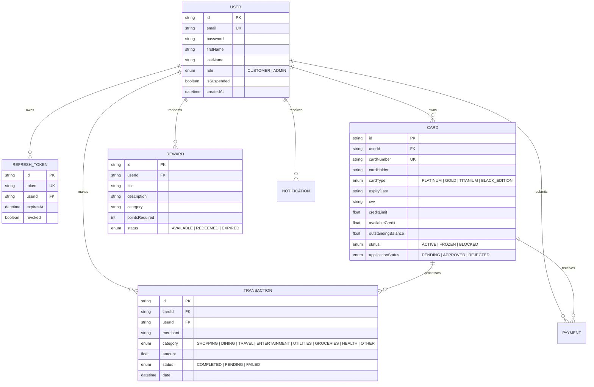
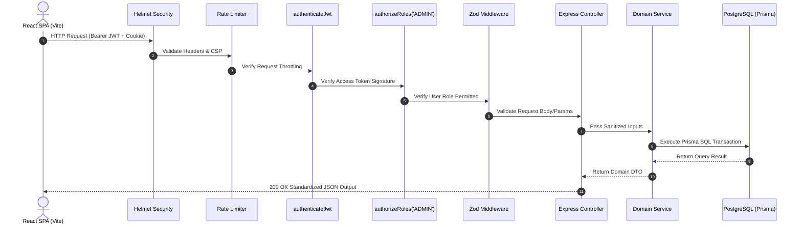

# CardFlow — Enterprise Credit Card Management Platform

An enterprise-grade, production-quality full-stack **Credit Card Management Platform** designed for high-throughput security, modern user experience, automated testing, and scalable cloud deployment.

Built with **Node.js, Express, TypeScript, Prisma ORM, PostgreSQL, JWT, Zod, Helmet, Morgan, Swagger, Jest, Supertest, React 18, Vite, Tailwind CSS, TanStack Query, Recharts, Docker, and Nginx**.

---

## 📐 System Diagrams

### 1. Database Entity-Relationship (ER) Diagram



---

### 2. API Request Architecture & RBAC Flow Diagram



---

## Technical Architecture & Design Rationale

### Tech Stack Selection & Justification

| Layer | Technology | Rationale & Portfolio Justification |
| :--- | :--- | :--- |
| **Frontend Framework** | **React 18 + Vite** | Sub-millisecond HMR during development and optimized tree-shaken production bundles. |
| **Async State & Caching** | **TanStack Query (@tanstack/react-query)** | Declarative async state management with background refetching, cache invalidation, and mutation management. |
| **Data Visualization** | **Recharts** | Responsive SVG chart visualizations for spending trends, card usage, and user acquisition growth. |
| **Language** | **TypeScript (Strict)** | End-to-end type safety eliminating runtime type mismatches between frontend contracts and backend APIs. |
| **Styling** | **Tailwind CSS** | Custom glassmorphism UI tokens, responsive flex/grid layouts, dynamic focus rings, and dark theme palette. |
| **API Docs** | **Swagger / OpenAPI 3.0** | Interactive API documentation generated dynamically at `/api-docs`. |
| **Security & Logging** | **Helmet + Morgan + Rate Limiters** | HTTP security headers, request logging, and rate limiting against brute-force attacks. |
| **Testing** | **Jest + Supertest** | Automated unit & integration test suite verifying Auth, Card, and Transaction routes. |
| **Containerization** | **Docker & Docker Compose** | Multi-stage Docker builds orchestrating PostgreSQL, Express API, and Nginx frontend. |
| **Server Framework** | **Node.js + Express** | High-concurrency non-blocking I/O ideal for RESTful API orchestration. |
| **Database & ORM** | **PostgreSQL + Prisma** | ACID-compliant relational data engine coupled with type-safe schema declarations and automatic migration tracking. |
| **Authentication & RBAC**| **JWT + HttpOnly Cookies + Middleware** | Access Tokens (15m) paired with database-backed Refresh Tokens (7d) in HttpOnly cookies. `authorizeRoles('ADMIN')` protects admin endpoints. |

---

## Interactive API Documentation (Swagger)

When running the backend server locally or via Docker, visit:
👉 `http://localhost:5000/api-docs`

This provides an interactive OpenAPI 3.0 interface to execute endpoints directly from your browser.

---

## 🛠️ How to Deploy & Run Locally

### Option A: Running with Docker Compose (Recommended)

Make sure Docker and Docker Compose are installed on your machine.

```bash
# Clone and navigate to root directory
cd CreditCardManagementSystem

# Build and launch PostgreSQL, Express Backend, and Nginx Frontend
docker-compose up --build
```
- **Frontend App**: `http://localhost` (Port 80)
- **Backend API**: `http://localhost:5000/api/v1`
- **Swagger Docs**: `http://localhost:5000/api-docs`

---

### Option B: Running Locally (Node.js & PostgreSQL)

#### 1. Backend Setup
```bash
cd backend
npm install
npx prisma generate
npm run prisma:seed    # Populate demo accounts, credit cards, transactions & rewards
npm run test           # Run Jest automated test suite
npm run dev            # Starts server at http://localhost:5000
```

#### 2. Frontend Setup
```bash
cd frontend
npm install
npm run dev            # Starts Vite dev server at http://localhost:5173
```

---

## Demo Credentials

- **System Administrator Account**:
  - **Email**: `admin@example.com`
  - **Password**: `AdminPass123!`
  - *Accesses Admin Command Center (`/admin/dashboard`)*

- **Customer Account**:
  - **Email**: `customer@example.com`
  - **Password**: `Password123!`
  - *Accesses Customer Dashboard (`/dashboard`)*

---

## 🚀 Render Cloud Deployment

The repository includes a `render.yaml` Blueprint specification for deployment to Render Cloud:

1. Connect your GitHub repository to Render.
2. Render will automatically detect `render.yaml` and provision:
   - A PostgreSQL database instance.
   - Node.js Express backend web service.
   - Static site frontend web service.
